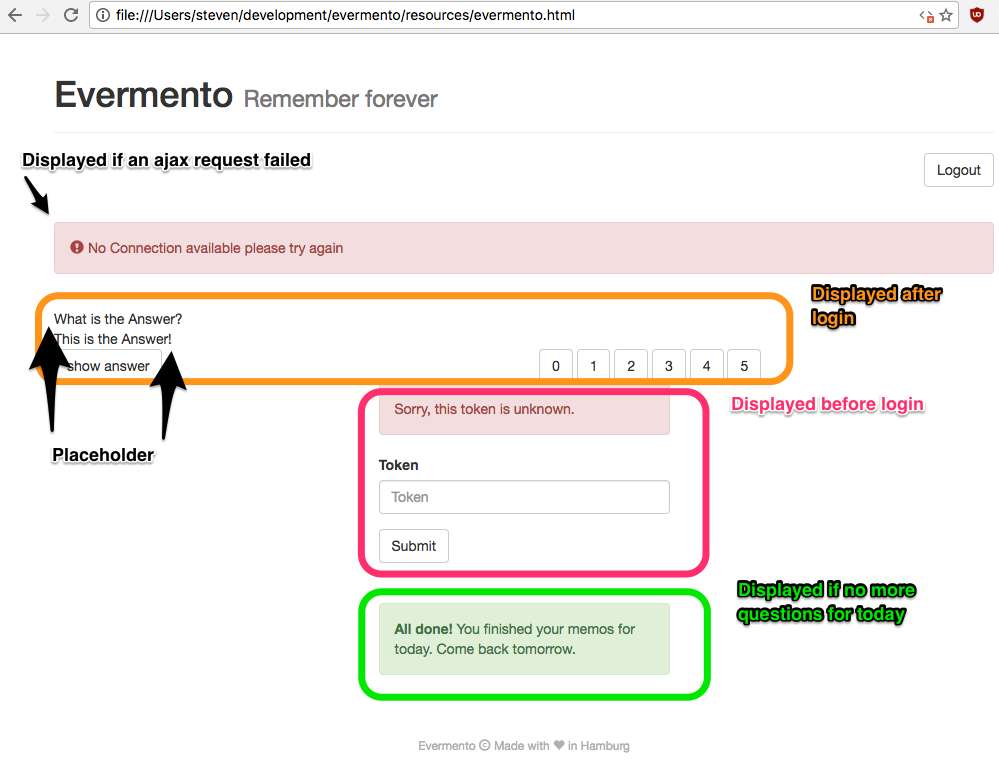
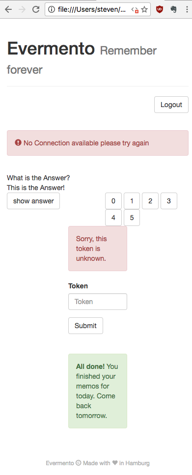

#HSLIDE

### True Separation of
### V
### in MVC

#HSLIDE

#### What is the problem?

Most view-components of current web apps ...

 1. ... impede the collaboration between designers and developers  <!-- .element: class="fragment" -->
 2. ... make it difficult for designers to contribute in the same way as developers  <!-- .element: class="fragment" -->
 3. ... hinder designers to leverage their skills  <!-- .element: class="fragment" -->

#VSLIDE

####  ... impede the collaboration between designers and developers
Example: No collaboration on the same artifacts
```HTML
 <#if ((products?size % (columns * 2) > 0 && products?size %
  (columns * 2) <= columns - 1 )) && menuProperties?? &&
  showBanner>
            <a href="/product">Product</a>
<#elseif
  (isRowEven || (isRowUneven && (!menuProperties?? ||
   !showBanner))) && product_has_next>
            <hr class="line"/>
</#if>
```

#VSLIDE

####  ... make it difficult for designers to contribute in the same way as developers
Example: "React makes it easy for designers to contribute." That is wishful thinking.

```JavaScript
class Clock extends React.Component {
  constructor(props) {
    super(props);
    this.state = {date: new Date()};
  }

  componentDidMount() {
    this.timerID = setInterval(() => this.tick(), 1000);
  }

  componentWillUnmount() {
    clearInterval(this.timerID);
  }

  tick() {
    this.setState({date: new Date()});
  }

  render() {
    return (
      <div>
        <h1>Hello, world!</h1>
        <h2>It is {this.state.date.toTimeString()}.</h2>
      </div>
    );
  }
}
```

#VSLIDE

#### ... hinder designers to leverage their skills
Example: Visual verification impossible
```HTML
<div ng-app=""
     ng-init="vals=['Potential','Long','Testdata']">
  <p>Looping with ng-repeat:</p>
  <ul>
    <li ng-repeat="x in vals">
      {{ x }}
    </li>
  </ul>
</div>
```
- without running server <!-- .element: class="fragment" -->
- or shipping test data  <!-- .element: class="fragment" -->
- <!-- .element: class="fragment" -->(plus [underpowered templates](http://2013.jsconf.eu/speakers/pete-hunt-react-rethinking-best-practices.html))  

#HSLIDE

#### Why is this a problem? I

"I am a full stack developer, I do not need a dedicated designer."

- Being excellent on all levels is really hard.   <!-- .element: class="fragment" -->
- A bounded context is still beneficial.   <!-- .element: class="fragment" -->

#VSLIDE

#### Why is this a problem? II

"Designers can hand over mockups or concept art and developers implement them."

- In this way, designers produce throw away artifacts. <!-- .element: class="fragment" -->
- Designers could instead iterate directly in HTML and get feedback immediately.    <!-- .element: class="fragment" -->
- This kind of collaboration will boost misunderstandings.  <!-- .element: class="fragment" -->

#VSLIDE

#### Why is this a problem? III

"This is not a problem in our project, since we automated all the moving parts. All designers only have to install docker, set the right flags, pull the image, start the container, install npm, gulp, webpack, babel, yarn, react, redux ..."

- Every additional tool makes the whole development process a little more brittle. <!-- .element: class="fragment" -->
- Development should simplify the design process, not complicate it. <!-- .element: class="fragment" -->

#HSLIDE

#### What is the solution?

- Write static, pure HTML files.     <!-- .element: class="fragment" -->
- Any dynamic parts are represented by placeholders.     <!-- .element: class="fragment" -->
- Add all elements that are displayed eventually.     <!-- .element: class="fragment" -->
- Transformations of the DOM with the actual values, depending on the app state, are either applied on the server or on the client-side.     <!-- .element: class="fragment" -->

#VSLIDE

#### Example

Local static html file for large displays



#VSLIDE

#### Example

Same html file for small displays



#VSLIDE

#### DOM transformations

```Haskell
transform :: [Selector] -> (AppState -> DOM -> DOM) -> DOM -> DOM
```

#VSLIDE

#### Example of a DOM transformation

This example uses [alive](https://github.com/lomin/alive), a selector-based (à la CSS) templating library for Clojure and ClojureScript

```Clojure
(me.lomin.alive.macros/deftemplate evermento-html
"evermento.html")
(me.lomin.alive.macros/import-id id#memo-container)
(me.lomin.alive.macros/import-class _subcontainer)
(me.lomin.alive.macros/import-class _answer)

(def page-container
  (com.rpl.specter.macros/select-first
    [id#page-container]
    evermento-html))

(defn get-attrs [node]
  (comment A hiccup structure looks like this:
           [:a {:href "http://github.com"} "GitHub"])
  (second node))

(defn select-container [container id]
  (com.rpl.specter.macros/transform
    [_subcontainer #(= id (:id (get-attrs %)))]
    (me.lomin.alive/replace-content [])
    container))

(defn render-answer [node]
  (let [change-visibility (if (show-answer?)
                            me.lomin.alive/remove-class
                            me.lomin.alive/add-class)]
    (->> node
         (alive/replace-content [(get-answer)])
         (change-visibility "hidden"))))

(com.rpl.specter.macros/transform
  [id#memo-container _answer]
  render-answer
  (select-container page-container "main-container"))
```

#HSLIDE

#### Why is that the solution?

 - Flexible: Designers can use any tools they like and are used to <!-- .element: class="fragment" -->
 - Simple: No sophisticated build chain, preprocessors, etc. necessary <!-- .element: class="fragment" -->
 - Powerful: Developers can use the full expressiveness of their language <!-- .element: class="fragment" -->
 - Testable: Easy to unit test  <!-- .element: class="fragment" -->

#VSLIDE

#### Example for unit test with alive
```Clojure
(deftest ^:unit render-answer-test
  (let [answer
        #(transform
           [evermento/id#memo-container evermento/_answer]
           evermento/render-answer)]

    (testing "show answer"
      (evermento/assoc-in* [:show-answer] true)
      (evermento/assoc-in* [:answer] "A test answer.")
      (is (= [:div {:class "answer"} "A test answer."]
             (answer))))

    (testing "do not show answer"
      (evermento/assoc-in* [:show-answer] false)
      (is (= [:div {:class "answer hidden"} "A test answer."]
             (answer))))))
```

#HSLIDE

#### Try alive

```Clojure
[me.lomin/alive "0.1.0"]
```

